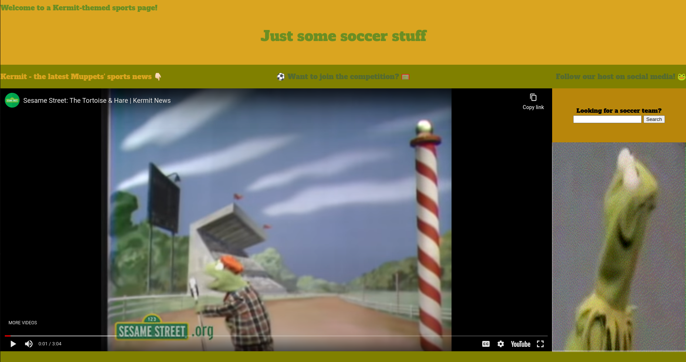
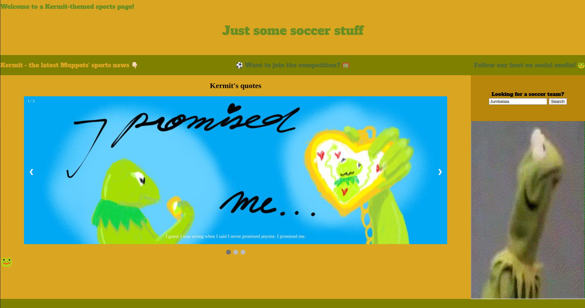
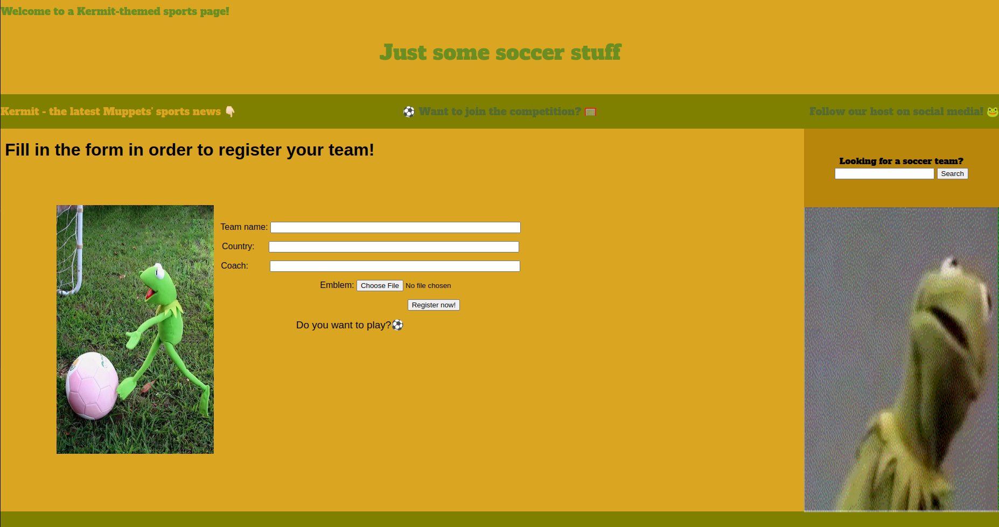
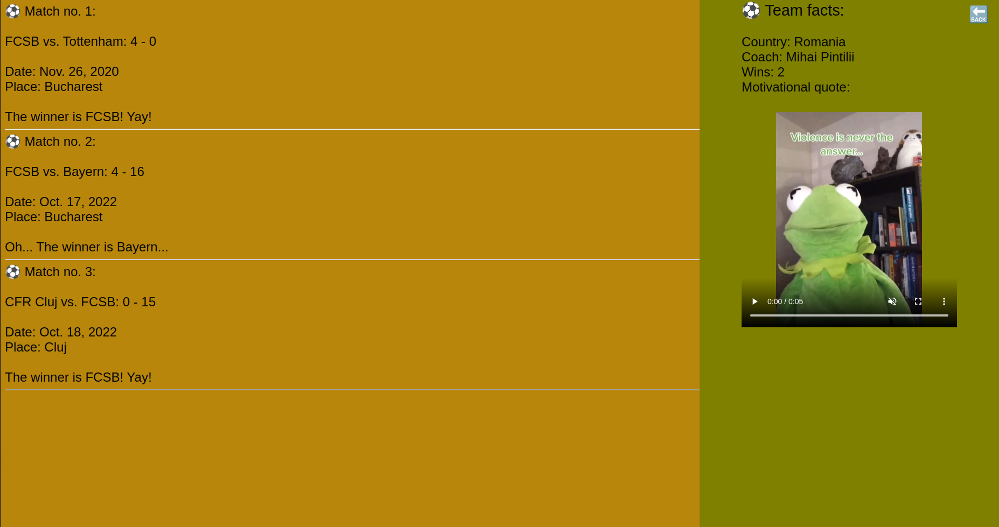
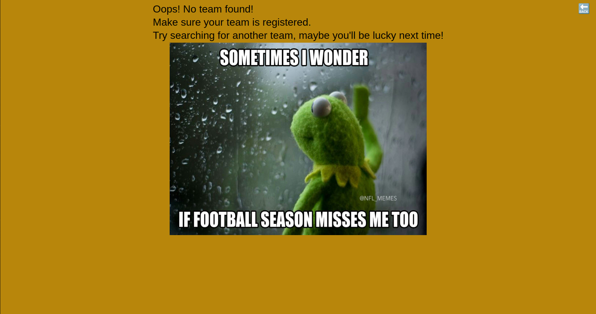
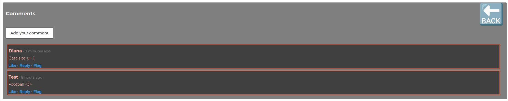

*Copyright 2022  (321CA - 2022/2023)*  
*(C) Arpășanu Emilia-Oana*  
*(C) Cismaru Diana-Iuliana*  
*(C) Drăgușin Daniela-Alexandra*  
*(C) Răducanu George-Cristian*

# Site rezultate sportive (Kermit)
## Proiect - Informatică Aplicată 4
---

## Descrierea proiectului:

* **Pagina principală**
> 
> Site-ul se deschide cu pagina principală, în care sunt implementate următoarele funcționalități:
>
> * videoclip introductiv cu prezentarea unor știri sportive
> * ⚽ -  momente importante din istoria fotbalului
> * 🥅 - vizualizarea emblemei anului
> * *Want to join the competition?* - redirectare către pagina de înregistrări a echipelor
> * *Follow out host on social media! 🐸* - redirectare către pagina de Instagram a lui Kermit
> * *Looking for a soccer team?* - formular ce redirectează către meciurile echipei căutate
> * Kermit GIF - buton ascuns ce redirectează către desene cu Kermit
---

* **Galeria de desene**
> 
> Pagina galeriei de desene conține desene cu Kermit.
>
> Butonul secret, 🐸, din josul paginii, trimite către o surpriză.
---

* **Înregistrări echipe**
> 
> Pagina este reprezentată de un formular în care se pot introduce date precum nume, țară, antrenor și, opțional, o emblemă, pentru înregistrarea unei noi echipe.
>
> De aici, putem ajunge, prin butonul *Do you want to play⚽* în pagina cu formularul pentru generarea unui meci.
---

* **Generarea meciurilor**
> 
> În formularul de pe această pagină se introduc datele dorite pentru un nou meci: numele echipei, data dorită și locația dorită.
---

* **Meciurile echipei căutate**
> 
> La introducerea unui nume de echipă existent, se vor afișa meciurile planificate pentru echipa respectivă (dacă există).
> 
> În cazul în care se introduce o echipă invalidă, se va afișa un mesaj corespunzător.
---

* **Comentarii**
> 
> Vizitatorii site-ului pot lăsa feedback și comentarii privitoare la acesta.

---
## Tehnologii utilizate:
În dezvoltarea acestui proiect au fost utilizate următoarele tehnologii:

* Python3 - Django
* HTML
* CSS
* SQLite

---
## Instrucțiuni rulare:
* Se rulează comanda „make” și apoi se accesează http://127.0.0.1:8000/my_application/ într-un browser la alegere.

---
## Contribuțiile membrilor:
* Arpășanu Emilia-Oana:
    * tematica site-ului
    * schelet HTML
    * formatare CSS
    * desene Kermit
    * debugging  
  

* Cismaru Diana-Iuliana:
    * documentație Django
    * implementare Django
    * README
    * debugging   
  

* Drăgușin Daniela-Alexandra:
    * documentație Django
    * README
    * debugging  
  

* Răducanu George-Cristian:
    * Makefile
    * testarea site-ului
    * introducerea înregistrărilor în baza de date
    * upload pe Git
    * debugging
  
 
* Cea mai mare dificultate a fost să învățăm Django și să facem debugging.
---
### Link către Repository-ul de Git: 
* https://github.com/GeorgeRaducanu/Site_rezultate_sportive_Kermit

 ### Resurse:
 * [Django Tutorial](https://www.w3schools.com/django/index.php)
 
 * [HTML Tutorial](https://www.w3schools.com/html/)
